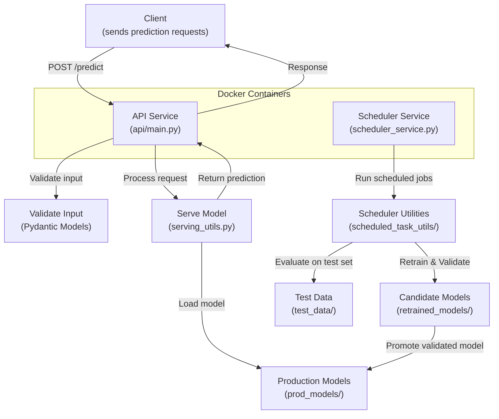

### Introduction

Welcome! This application is a **Task Scheduler** that simulates periodic re-training jobs, running checks and updating the **model serving** on a **_FastAPI_** service upon request.

- Main API Routes File: [api/main.py](api/main.py)
- Main Task Scheduler File: [scheduled_task/scheduler_service.py](scheduled_task/scheduler_service.py)
- For a Quick-Start Guide, please refer to the [quick-start-guide.pdf](quick-start-guide.pdf) document.
- To see the origin of the trained models, refer to the [training.ipynb](training.ipynb) notebook.
- APScheduler Documentation: https://apscheduler.readthedocs.io/



### Quick-Start Summary

1. In this _ml-scheduler_ directory, run **_docker compose up --build_**
2. Two services spin up from separate containers, **api** and **scheduler**.
3. After the container is on, navigate to the SwaggerUI Docs on the browser at http://localhost:8000/docs
4. Go to **/predict** POST request, click “Try it out”, and click “Execute” on sample request body. Scroll to see resulting response body.
5. Every interval, the scheduler will conduct checks and measure metrics.
6. Depending on metrics, it may update model served by API to a new one.
7. Try **/current_model** GET request to verify the update.

### App Components

- **API Service**

  - Runs a FastAPI application exposing ML prediction endpoints.
  - Uses Pydantic models for request validation and schema docs.
  - Includes unit tests under api/tests/, including for:
    - Model Initialization
    - Model Serialization
    - Model Updating
    - Prediction Requests
    - API Responses

- **Scheduler Service** via **_APScheduler_**:
  - Runs independently of the API as a separate container.
  - Simulates re-trainings that consider updates to the API model being served.
  - Checks data quality, API health & response latency, and ML evaluation metrics before updating models.
  - If metrics are satisfactory, requests an update to the model served by sending a new model object.

### Project File Structure

```
├── api/ # FastAPI App (Main API Service)
│ |
│ ├── main.py # Entry point for API having all routes
│ ├── schema_config.py # Schema of incoming prediction requests
│ ├── serving_utils.py # Utility functions for serving models
│ ├── prod_models/ # Folder to save & load production models
│ └── tests/ # PyTest Unit Tests testing API functionality
│
|
├── scheduled_task/ # Scheduled Task Service
| |
│ ├── scheduler_service.py # Main scheduled task runner
│ └── scheduled_task_utils/ # Re-training validation checks
│ └── retrained_models/ # Candidate models for updating API
│ └── test_data/ # Test dataset to validate models
|
|
├── requirements.txt # Python 3.10 dependencies
├── Dockerfile # Container build definition
├── docker-compose.yml # Multi-service orchestration
├── environment.yml # Conda env to replicate
```
